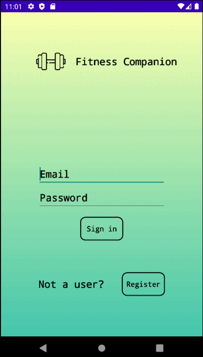

# Fitness Companion

Fitness companion is a adaptive and personlized fitness application that tracks its users' daily steps, calculates their Body Mass Index (BMI) and keeps up to its users' information to provide accurate measure of their daily fitness goals.

## Preview:

## Overview

1. `User Login`: Once users register themselves into the system they can access the system by using the User Login feature of the application. They just need to type in the email that they registered with and the password they entered at the time of registration.

2. `User Registration`: This is the best way for a new user to access the system. They need to click on register and this feature will guide them along the entire process of registration. Once registered successfully they can take advantage of the features like Step Counter, BMI Calculator and Update Personal Information.

3. `Step Counter`: This feature allows users to track their daily steps just with a single click. This system shows the user their steps for the previous three days and keeps them aware of their daily steps.

4. `BMI calculator`: This feature educates users about BMI and helps them to measure it based on their current credentials as well as shows their previous BMI based on their past credentials.

5. `Updating personal information`: This feature allows users to update their personal information like changing weight, age, height etc. Also, it allows users to correct a typo in their names in case someone mistypes it making it a significant feature of the system.

## Project Details:

### Our Vision [here](./VISION.md)

### Our Architecture [here](./Documentation/ARCHITECTURE.md)

### View our project architecture [here](./Documentation/ARCHITECTURE.md)

### View our branching strategy [here](./Documentation/Group4Branching.md)

### View our iteration 1 worksheet [here](./Documentation/i1_worksheet.md)

### View our iteration 2 worksheet [here](./Documentation/Iteration_2_Worksheet.md)

### View our iteration 3 worksheet [here](./Documentation/Iteration_3_Worksheet.md)

**Note**: Some of the links in the `.markdown` might not work as this project was originally hosted on University of Manitoba's GITLAB server.

### How to run the project:

> **Do not run mockito along with systems test it is because both the frameworks has same class name in their libraries**
- The best way to run tests is that you can comment mockito dependency in the dependencies in build gradle file when running unit tests and uncomment the dependency when running the systems test. Otherwise the build will fail.
